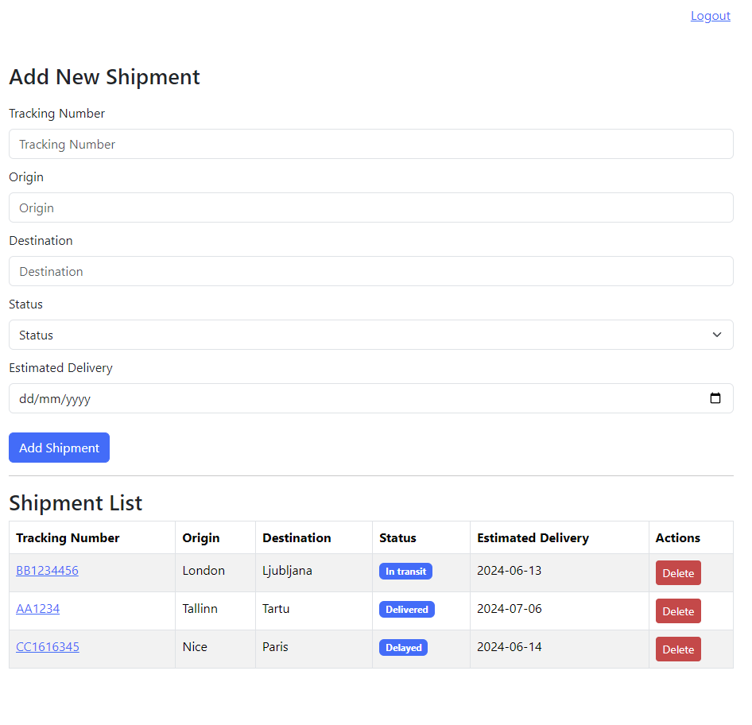
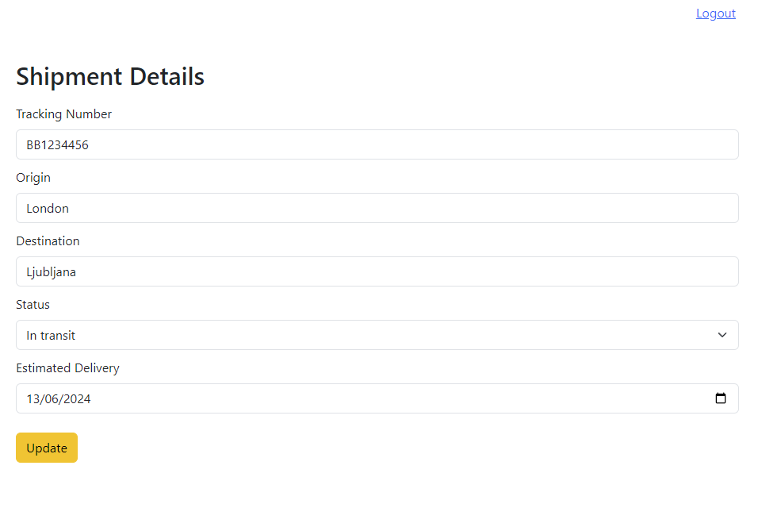
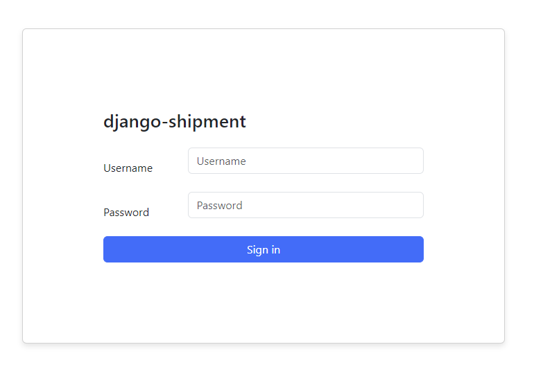

# django-shipment

A simple django REST API application using Python, React, PostgreSQL and Docker.

## Prerequisites

Stack I used

1. Git
2. At least Python 3.9
3. Node version 22
4. Docker 26.0.0

## Instructions for local environment

### Setup

First 3 commands are necessary only on setup

1. Create the container ``docker-compose up --build``
2. Create admin ``python manage.py createsuperuser``
3. Update database ``python manage.py migrate``
4. In ``shipment-frontend`` folder run ``npm install``

### Run

5. Run ``python manage.py runserver``
6. In ``shipment-frontend`` run ``npm start``

## Run tests

1. Backend: Run ``pytest``
2. Frontend: In ``shipment-frontend`` run ``npm test``

## Result

Log in with created admin user

* Application will be accessible at http://localhost:3000/
* Backend will be accessible at http://localhost:8000/admin/

